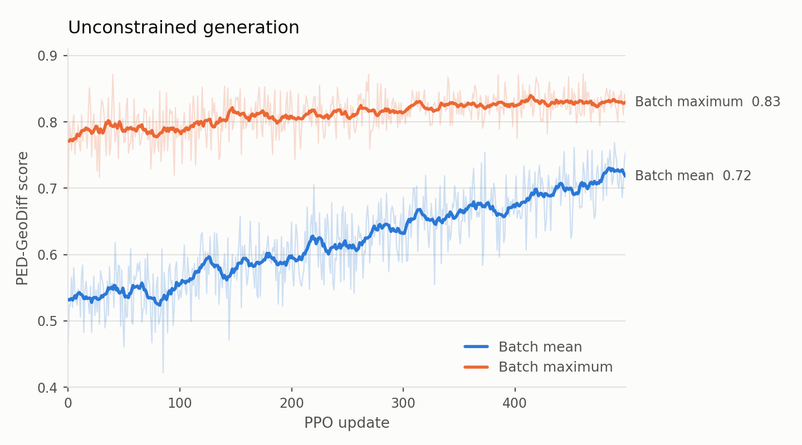
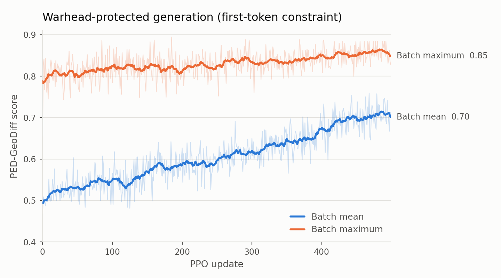

# SynGenMol demonstrations

This release contains two runnable PED-GeoDiff demonstrations. They share one code path, one reaction-template asset, and the same hyperparameters; the constrained variant differs only by the `initial_building_block_constraint` configuration key. Both ship their published results, so the numbers below can be checked without a GPU.

The objective in both is PED-GeoDiff 3D ligand similarity to a single reference SMILES. It is not a prediction of potency, selectivity, ADMET, covalent binding, or experimental synthetic success, and reaction-template feasibility does not establish yield, selectivity, or route practicality.

## Shared assets

| Asset | Contents |
|---|---|
| `data/reactions/syngenmol_reactions_v1.smi` | 180 ordered reaction SMARTS records |

The 180 records are the 90 two-component reactions of Gao et al. (SynFormer), each written in both reactant orders so either partner can open a route; see [`../data/reactions/REACTION_TEMPLATES.md`](../data/reactions/REACTION_TEMPLATES.md).

## Workflow

Both demonstrations run the same four stages:

1. `prepare-search-space` — tokenize the building blocks and retain the reaction templates that have a compatible block in both reactant positions.
2. Terminal-value MSE warm-up on the included scored trajectory table. This jointly updates the Transformer trunk and the value head; it is not route pretraining.
3. PPO, 500 updates, each generating and GeoDiff-scoring a fresh 64-trajectory rollout batch.
4. `generate` — sample and score 1,000 unique products with the trained checkpoint.

Warm-up tables are supplied already sampled and scored, so no initial route sampling or warm-up scoring is needed. Steps 1–2 of the top-level [`README.md`](../README.md) must be completed first, so `SYNGENMOL_GEODIFF_CHECKPOINT` is set.

## Settings

Both configurations use these values.

| Group | Settings |
|---|---|
| `model` | `n_embd: 64`, `n_layer: 2`, `n_head: 2` |
| `warmup` | `epochs: 10`, `batch_size: 64`, `learning_rate: 1.0e-4`, `validation_fraction: 0.2` |
| `ppo` | `steps: 500`, `batch_size: 64`, `mini_batch_size: 64`, `learning_rate: 1.0e-4`, `ppo_epochs: 4`, `max_reactions: 1`, `clip_range: 0.2`, `value_clip_range: 0.2`, `value_loss_coefficient: 0.5`, `gamma: 1.0`, `lam: 0.95`, `initial_kl_coefficient: 0.05`, `reference_ema_decay: 0.99`, `reference_update_interval: 3`, `maximum_molecular_weight: 800.0` |
| `oracle` | `name: ped_geodiff`, `embedding_mode: "3D"`, `distance_metric: euclidean`, `transformation: {high: 10.0, low: 1.0, k: -0.25}`, `invalid_score: 0.0`, `batch_size: 64`, `seed: 42` |
| `generation` | `num_molecules: 1000`, `max_reactions: 1`, `temperature: 1.0`, `top_p: 1.0`, `epsilon: 0.0` |

Where they differ:

| Setting | Unconstrained | Warhead-constrained |
|---|---|---|
| `initial_building_block_constraint` | omitted | `names_file: data/example/syngenmol_demo_warhead_constraint_anchor_names.txt` |
| `ppo.entropy_coefficient` | `0.1` | `0.0` |
| `oracle.reference_smiles` | crotonamide BMS-986195 | Boc-protected BMS-986195 |
| `seed` | `20260904` | `20260908` |

The KL reference policy is an exponential moving average of the policy itself, refreshed every third update. Products at or above 800 Da keep a score of 0.0 and are never sent to the oracle.

## Unconstrained demonstration

| Input | Contents |
|---|---|
| `data/example/syngenmol_demo_unconstraint_building_blocks.csv` | 2,000 anonymized building blocks, `BB-0000`–`BB-1999` |
| `data/example/syngenmol_demo_unconstraint_warmup_trajectories.csv` | 4,000 unique scored one-step products |
| `data/example/syngenmol_demo_unconstraint_metadata.json` | Construction record and checksums |

```bash
syngenmol prepare-search-space \
  --input data/example/syngenmol_demo_unconstraint_building_blocks.csv \
  --id-column name \
  --smiles-column smiles \
  --reaction-templates data/reactions/syngenmol_reactions_v1.smi \
  --output-dir outputs/syngenmol_demo_unconstraint/search_space

syngenmol train    --config configs/syngenmol_demo_unconstraint_train.yaml
syngenmol generate --config configs/syngenmol_demo_unconstraint_generate.yaml
```

2,000 building blocks and 180 reaction records yield 149 retained templates. The reference run took 37 minutes on a single A100.

The figure plots, for every PPO update, the mean score of that update's 64-trajectory batch and the highest score in it; faint lines are the raw per-update values and heavy lines a centred 15-update rolling mean.



| Stage | Result |
|---|---|
| Warm-up pool | 4,000 trajectories, mean 0.447, max 0.864 |
| PPO updates 1–100 | mean score 0.5399 |
| PPO updates 401–500 | mean score 0.7016 |
| Best rollout | batch mean 0.769, best individual 0.873 |
| Generation | 1,000 unique products, mean 0.6086, median 0.6476, max 0.8676 |
| Generation, at or above 0.70 / 0.80 | 373 / 75 |

Both series rise, so the policy reaches scores it had not sampled during warm-up rather than merely concentrating on what it already found. Over the same span the KL divergence to the reference policy grew from 0.38 to 1.40 and policy entropy decayed from 7.42 to 6.50. The 1,000 products come from only 303 distinct building-block pairs across 54 template selections, so this list is a demonstration of optimization, not a diverse library.

## Warhead-constrained demonstration

This variant requires every generated route to open with a Boc-protected primary amine, so each product carries exactly one masked amine at which a covalent warhead can later be installed. The constraint is enforced by intersecting the reaction-compatible position-0 token set with the named anchor set, during PPO rollouts as well as final generation, so sampling cannot violate it. Optimization and scoring happen on the protected intermediates; deprotection and warhead installation are left to a separate post-processing step.

| Input | Contents |
|---|---|
| `data/example/syngenmol_demo_warhead_constraint_building_blocks.csv` | 2,200 anonymized building blocks: the base 2,000 plus 200 added primary amines |
| `data/example/syngenmol_demo_warhead_constraint_warmup_trajectories.csv` | 4,000 unique scored constrained one-step products |
| `data/example/syngenmol_demo_warhead_constraint_anchor_names.txt` | 678 permitted first-position anchors |
| `data/example/syngenmol_demo_warhead_constraint_anchors.csv` | The same anchors with deprotected and Boc-protected SMILES and `anchor_origin` |
| `data/example/syngenmol_demo_warhead_constraint_metadata.json` | Construction record and checksums |

```bash
syngenmol prepare-search-space \
  --input data/example/syngenmol_demo_warhead_constraint_building_blocks.csv \
  --id-column name \
  --smiles-column smiles \
  --reaction-templates data/reactions/syngenmol_reactions_v1.smi \
  --output-dir outputs/syngenmol_demo_warhead_constraint/search_space

syngenmol train    --config configs/syngenmol_demo_warhead_constraint_train.yaml
syngenmol generate --config configs/syngenmol_demo_warhead_constraint_generate.yaml
```

Generation yields Boc-protected intermediates, so convert them back to the warhead form once it finishes: `python docs/restore_warhead.py --input outputs/syngenmol_demo_warhead_constraint/results/generated_molecules_geodiff.csv --building-blocks data/example/syngenmol_demo_warhead_constraint_building_blocks.csv --templates outputs/syngenmol_demo_warhead_constraint/search_space/reaction_templates.smi` re-runs each recorded route with the anchor nitrogen atom-tracked, removes every Boc carbamate, and crotonylates that nitrogen to give the E-crotonamide.

2,200 building blocks and 180 reaction records yield 115 retained templates. Every anchor is legal at position 0, and the anchor set collectively opens 85 of those 115 templates.

The 678 anchors are 478 blocks already present in the base 2,000, plus 100 selected because they appear in a high-scoring recorded route and 100 drawn at random; `anchor_origin` records which. Ten further single-amine candidates were excluded for carrying more than one primary amine. The 100 high-scoring anchors were pre-selected on the metric being optimized here, so the score distribution below shows that the constraint holds under optimization rather than measuring search performance.

Axis limits match the unconstrained figure, so the two are directly comparable.



| Stage | Result |
|---|---|
| Warm-up pool | 4,000 trajectories, mean 0.484, max 0.871 |
| PPO updates 1–100 | mean score 0.530 |
| PPO updates 401–500 | mean score 0.695 |
| Best rollout | batch mean 0.759, best individual 0.894 |
| Generation | 1,000 unique products, mean 0.653, median 0.685 |
| Generation, top 10 / top 100 | 0.871 / 0.833, max 0.887 |
| Constraint | 1,000/1,000 first building blocks inside the anchor set; 163 distinct anchors used |

The first-token constraint does not prevent the policy from finding higher-scoring products; it only fixes which building block opens each route.

`product_smiles` in the published candidate list is always the Boc-protected intermediate; `warhead_product_smiles` and `warhead_status` hold the converted form. 768 of 1,000 convert to a single E-crotonamide (`warhead_installed`). The remaining 232 all used template 96, whose `[#6:4][OH,nH,NH:5]` pattern reacts at the carbamate nitrogen itself, so the masked warhead site is consumed and no warhead can be installed (`warhead_site_consumed`, empty SMILES). Check `warhead_status` before treating any row as a warhead compound.

## Published artifacts

```text
outputs/syngenmol_demo_unconstraint/results/generated_molecules_geodiff.csv        1,000 generated products, scored and ranked
outputs/syngenmol_demo_unconstraint/results/ppo_score_curve.csv                    per-update score, KL, entropy, EMA-refresh flag, 500 updates
outputs/syngenmol_demo_unconstraint/results/run_summary.json                       headline numbers reproduced above
outputs/syngenmol_demo_warhead_constraint/results/generated_molecules_geodiff.csv  1,000 generated protected candidates, scored and ranked, with warhead-converted SMILES
outputs/syngenmol_demo_warhead_constraint/results/ppo_score_curve.csv              per-update score, KL, entropy, EMA-refresh flag, 500 updates
outputs/syngenmol_demo_warhead_constraint/results/run_summary.json                 headline numbers reproduced above
```

[`figures/plot_ppo_curves.py`](figures/plot_ppo_curves.py) redraws both figures from the two `ppo_score_curve.csv` files.

Trained checkpoints, full PPO metric histories, scheduler logs, prepared search spaces, and external PED/GeoDiff assets are not distributed. A re-run writes them under each demonstration's `outputs/<demo>/` directory and leaves the published `results/` untouched. Search spaces regenerate deterministically from the shipped building-block tables and reaction records, so token IDs match the published results exactly.
